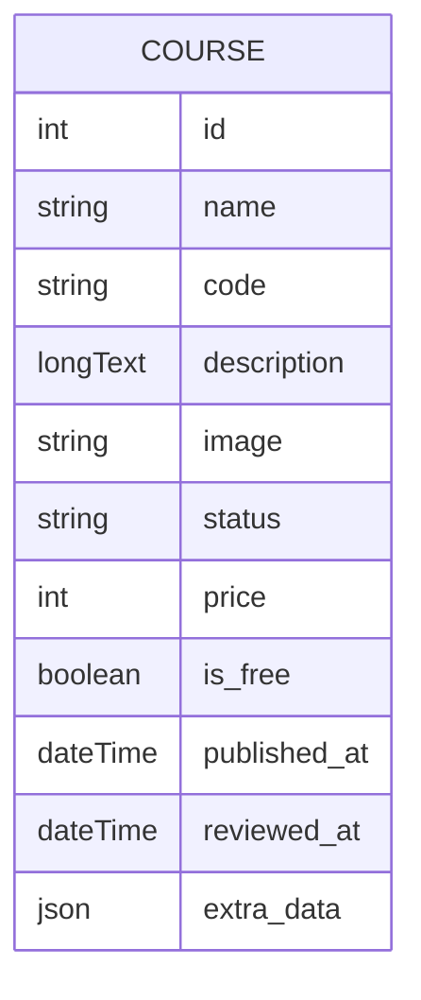
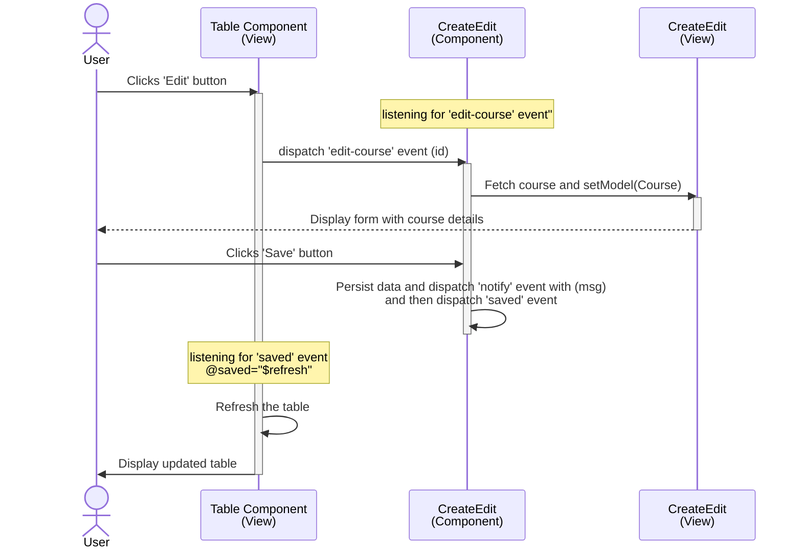
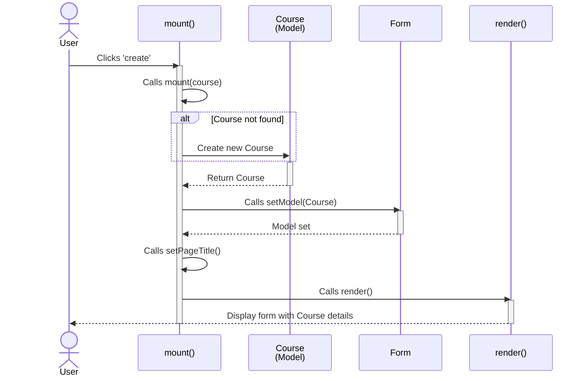
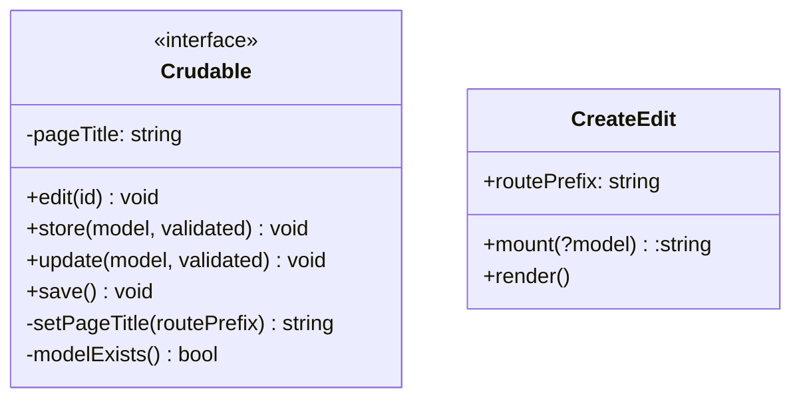
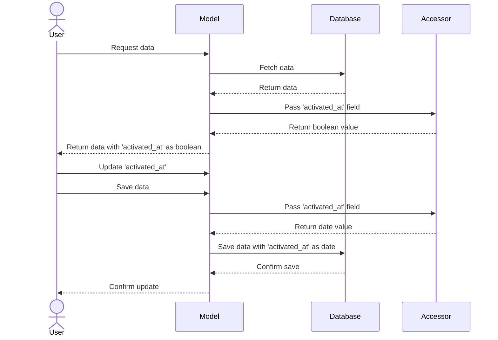

# NAYKEL Web Application

### Course Table ERD

### Edit Event Sequence Diagram

This diagram shows the sequence of events when the user selects a course to `edit` from the table view.

- The `CrateEdit::class` has an `edit` method that listening for the `edit-course` event.
- The `table` view will dispatch the `edit-course` event using the `$dispatchTo` method when the `edit` button is clicked.
- After changes are complete, the user will click the save button which will fire the `save` method in the `CreateEdit::class`
- The `save` method will dispatch the `notify` event to display the toast component with the `save` message.
- The `save` method will dispatch the `saved` event to tell the `table` view to refresh the table.
- The `table` view listens for the `saved` event and refresh the table.

## 'Create' Event Sequence Diagram

This diagram shows the sequence of events to mutate a date field to a boolean value and back
again. The `activated_at` field is a date field in the database but is displayed as a boolean
value in the UI. The `activated_at` field is set to `null` when the user clicks the `deactivate`
button and set to the current date when the user clicks the `activate` button.

protected function activatedAt(): Attribute
{
    return Attribute::make(
        get: fn ($value) => $value ? true : false,
        set: fn ($value) => $value ? now() : null,
    );
}
